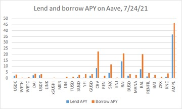

## Simple Summary

This proposes raising the maximum AMPL interest rate to better balance incentives between the borrowing and lending sides of the market.

## Motivation

Following [API-12](https://governance.aave.com/t/proposal-add-support-for-ampl/854/8), [AMPL borrowing & lending](https://app.aave.com/reserve-overview/AMPL-0xd46ba6d942050d489dbd938a2c909a5d5039a1610xb53c1a33016b2dc2ff3653530bff1848a515c8c5) went live on the AAVE v2 market [date=2021-07-24 time=20:22:00 timezone="UTC"].

Since then, there has been a near 100% utilization rate of deposited assets. This suggests the maximum cap of the interest rate curve is not able to reach a high enough value to effectively balance incentives between the borrow side and lending side of the marketplace.

While the AMPL spot market is currently in a relatively extreme condition, the AAVE borrowing market should be able to perform efficiently in all market scenarios.

## Specification

We suggest the following parameters for AAVE's default [interest rate model](https://docs.aave.com/risk/liquidity-risk/borrow-interest-rate#interest-rate-model):

- Optimal utilization = 75%
- Slope1 = 2%
- Slope2 = 10,000%

This leads to a piecewise linear curve with two parts and three defining points:

- Borrow Interest(0) = 0% APY
- Borrow Interest(75) = 2% APY
- Borrow Interest(100) = 10002 % APY

## Rationale

A higher cap of the borrow interest rate will allow the marketplace to have a more sustainable equilibrium.

Since this will result in overall higher fees coming into the system, in tandem we also suggest lowering the reserve factor from 20% to 10% to incentivize more depositors. This would be submitted as a separate AIP to decouple these two decisions.

We believe a nonlinear interest curve is healthiest long-term and could likely be used by many other assets as well, however this work can be discussed more in the future.

## Implementation

A deployment of the existing implementation of the Interest Strategy will be used, with the following parameters:

    optimalUtilizationRate: new BigNumber(0.75).multipliedBy(oneRay).toFixed(),
    baseVariableBorrowRate: new BigNumber(0).multipliedBy(oneRay).toFixed(),
    variableRateSlope1: new BigNumber(0.02).multipliedBy(oneRay).toFixed(),
    variableRateSlope2: new BigNumber(100).multipliedBy(oneRay).toFixed(),

[https://etherscan.io/address/0x509859687725398587147Dd7A2c88d7316f92b02#readContract](https://etherscan.io/address/0x509859687725398587147Dd7A2c88d7316f92b02#readContract)

## Copyright

Copyright and related rights waived via [CC0](https://creativecommons.org/publicdomain/zero/1.0/).
